# Hey, I'm Prakash Kumar 👋

**DevOps Engineer · Cloud Engineer · SRE · AI/ML Developer · Full Stack**

_Building scalable infrastructure, intelligent systems, and impactful products._

---

## About Me

- 🎓 B.Tech CSE @ Dronacharya Group of Institutions, Greater Noida — **CGPA 8.3** (2022–2026)
- ☁️ Targeting **DevOps / Cloud Engineering / SRE** roles
- 🤖 Building AI agents, SaaS platforms, and cloud-native systems
- 🔭 Currently working on **TickZen** (AI task manager) and **MedTrackFit** (healthcare SaaS)
- 🌱 Exploring **PyTorch**, **LoRA/PEFT fine-tuning**, **RAG Systems**, and **AI Agents**
- 📫 Reach me at **prakashkr2894@gmail.com**

---

## Tech Stack

## Languages

## Frontend

## Backend & Databases

## Cloud & DevOps

## AI / ML

&nbsp;

## Tools & Platforms

&nbsp;

---

## 📊 GitHub Analytics

---

## 🚀 Featured Projects

### TickZen — AI Powered Task Management SaaS

> Voice-to-action AI task manager powered by **ZentriXA**, an AI assistant that converts speech into executable actions.

<table>
  <tr>
    <td width="60%" valign="top">

|                |                                                      |
| -------------- | ---------------------------------------------------- |
| **Stack**      | FastAPI · MongoDB · Docker · OpenRouter · AssemblyAI |
| **CI/CD**      | GitHub Actions automated deployment                  |
| **Security**   | OTP Authentication                                   |
| **AI Feature** | ZentriXA voice-to-action AI assistant                |

    </td>
    <td width="40%" valign="top" align="center">
      
    </td>

  </tr>
</table>

---

### MedTrackFit — Health Recovery Platform

> Healthcare SaaS connecting patients, mentors, recovered users, and doctors in one ecosystem.

<table>
  <tr>
    <td width="60%" valign="top">

|           |                                                |
| --------- | ---------------------------------------------- |
| **Stack** | Spring Boot · MySQL · OAuth2 · Spring Security |
| **Scale** | Multi-role healthcare platform                 |
| **Roles** | Patient · Mentor · Doctor ecosystem            |

    </td>
    <td width="40%" valign="top" align="center">
      
    </td>

  </tr>
</table>

---

### VARTALAP — Communication Platform

> Modern communication and collaboration platform built for real-time interaction.

<table>
  <tr>
    <td width="60%" valign="top">

    </td>
    <td width="40%" valign="top" align="center">
      
    </td>

  </tr>
</table>

---

### Aura Elysian — AI-Powered Luxury Fashion Platform

> A premium AI-driven fashion discovery and styling platform delivering personalized luxury experiences powered by intelligent recommendations.

<table>
  <tr>
    <td width="60%" valign="top">

|                |                                                 |
| -------------- | ----------------------------------------------- |
| **Stack**      | React · FastAPI · MongoDB · OpenRouter · Docker |
| **AI Feature** | Personalized outfit recommendations & style AI  |
| **Design**     | Luxury glassmorphism UI with premium aesthetics |
| **CI/CD**      | GitHub Actions automated deployment             |

    </td>
    <td width="40%" valign="top" align="center">
      
    </td>

  </tr>
</table>

---

## 💼 Experience

**Software Developer Intern — Agrasar Soft Consultancy** _(Nov 2024 – May 2025)_

- Built ERP platform for coaching institutes
- Designed REST APIs and authentication systems
- Managed GitHub Actions CI/CD deployments

**IBM SkillsNetwork (PBEL) — Virtual Intern**

- Enterprise web and mobile development
- Backend architecture and API design

---

## 🏆 Certifications

---

## 🕹️ Contribution Graph

> \_AI isn't waiting for anyone. Build with it, challenge it, or adapt to it.

<picture>
  <source media="(prefers-color-scheme: dark)"  srcset="pacman-contribution-dark.svg">
  <source media="(prefers-color-scheme: light)" srcset="pacman-contribution-light.svg">
  
</picture>

---

_"Building scalable software, intelligent systems, and impactful products."_

